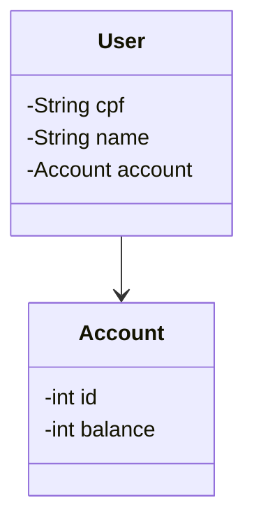

# api-on-the-cloud-challenge

```mermaid
classDiagram
    class User {
        -String cpf
        -String name
        -Account account
    }

    class Account {
        -int id
        -int balance
    }

    User --> Account
```