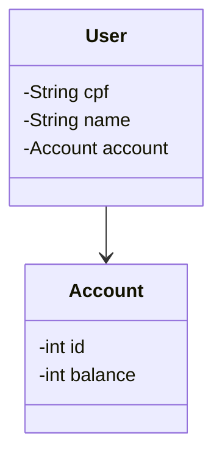

# API on the cloud challenge

DIO java bootcamp with IA challenge

#### Follow below the class diagram for this challenge:



## To configure enviroment variable for Spring Boot on VS code studio:
#### Add the code below on file .vscode/launch.json:
```json
{
    "version": "0.2.0",
    "configurations": [
      {
        "type": "java",
        "request": "launch",
        "name": "Spring Boot",
        "cwd": "${workspaceFolder}",
        "console": "integratedTerminal",
        "mainClass": "takayama.edu.cloudchallenge.Application",
        "env": {
          "SPRING_PROFILES_ACTIVE": "dev"
        }
      }
    ]
}
```